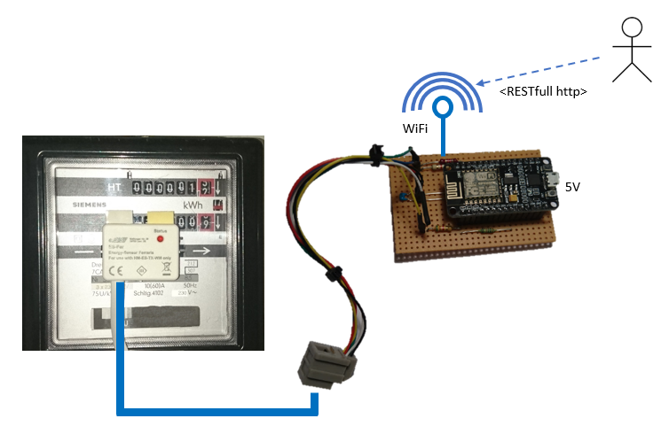

# WiFi Energy Monitor for electromechanical induction watt-hour meters ('Ferraris-Zähler')

This project contains a firmware and schematic for a WiFi based Energy Monitor which can be connected to a 
electromechanical induction watt-hour meters ('Ferraris-Zähler') using the 
[ELV Sensor ES-Fer](https://www.elv.de/homematic-zaehlersensor-ferraris-zaehler-es-fer.html), which is normally intended 
to be used with the HomeMatic ecosystem. Using the transmission board described here, the sensor data is made available via
WiFi and http RESTfull API. This way it can be used in many other scenarios outside HomeMatic (e.g. Node-Red).

An ESP8266 ESP-12E NodeMcu WiFi board is used for connectivity and sensor evaluation. 

## Usage

### REST-API
The board has a RESTfull http interface which returns all data as json objects.
There is an API description in [OpenAPI 2.0](https://github.com/OAI/OpenAPI-Specification) format in the folder `api`. 
It is recommended to use the [Swagger Editor](https://editor.swagger.io/) to open and view the API documentation. 
The editor also allows you to generate client code to access the API from the runtime/language of your choice.

Here is also a short summary:

<table><tr><td>Path</td><td>Method</td><td>Summary</td></tr><tr><td>/info</td><td>GET</td><td>Gets info about board and system status.</td></tr><tr><td>/meters</td><td>GET</td><td>Gets the energy meters.</td></tr><tr><td>/meters/{idMeter}</td><td>GET</td><td>Gets an energy meter.</td></tr><tr><td>/meters/{idMeter}/counters</td><td>GET</td><td>Gets the counters of an energy meter.</td></tr><tr><td>/meters/{idMeter}/counters/{idCounter}</td><td>GET</td><td>Gets a single counter of an energy meter.</td></tr><tr><td>/meters/{idMeter}/counters/{idCounter}/kWh</td><td>GET</td><td>Gets the kilowatt-hour of a counter of an energy meter.</td></tr><tr><td>/meters/{idMeter}/counters/{idCounter}/kWh</td><td>PUT</td><td>Set the kilowatt-hour counter of an energy meter.</td></tr><tr><td>/meters/{idMeter}/counters/{idCounter}/revolutions</td><td>GET</td><td>Gets the number of revolutions of the disc of an energy meter.</td></tr><tr><td>/meters/{idMeter}/counters/{idCounter}/revolutions</td><td>PUT</td><td>Set the number of revolutions of the disk of an energy meter.</td></tr><tr><td>/meters/{idMeter}/revsPerKWh</td><td>PUT</td><td>Sets the number of revolutions per kilo watt-hour.</td></tr><tr><td>/meters/{idMeter}/revsPerKWh</td><td>GET</td><td>Gets the number of revolutions per kilo watt-hour.</td></tr><tr><td>/meters/{idMeter}/threshold</td><td>PUT</td><td>Sets the threshold for the sensor of an energy meter.</td></tr><tr><td>/meters/{idMeter}/threshold</td><td>GET</td><td>Gets the threshold for the sensor of an energy meter.</td></tr></table>

## Build instructions

### Hardware
You can find a [fritzing](http://fritzing.org) schematic in the folder `hardware` which shows the pin layout. 

### Firmware
To build the arduino sketch:

- Install Arduino IDE
  - Use the Arduino Board Manager to install the ESP8266 toolchain (https://github.com/esp8266/Arduino) 
  - Use the Arduino Library Manager to install ArduinoJSON (https://bblanchon.github.io/ArduinoJson/)
- Open the sketch and modify the settings in the `config.h` header. You have to set the SSID and password of your wifi network.
- Compile and download to nodemcu.

## History
- 2017-oct-01: 0.1.0 - Created first version.
- 2017-oct-12: 1.0.0 - Completed API.

## Credits
- Sebastian Krauskopf (sebakrau)

## License
The MIT License (MIT)

Copyright (c) 2017 sebakrau

Permission is hereby granted, free of charge, to any person obtaining a copy
of this software and associated documentation files (the "Software"), to deal
in the Software without restriction, including without limitation the rights
to use, copy, modify, merge, publish, distribute, sublicense, and/or sell
copies of the Software, and to permit persons to whom the Software is
furnished to do so, subject to the following conditions:

The above copyright notice and this permission notice shall be included in all
copies or substantial portions of the Software.

THE SOFTWARE IS PROVIDED "AS IS", WITHOUT WARRANTY OF ANY KIND, EXPRESS OR
IMPLIED, INCLUDING BUT NOT LIMITED TO THE WARRANTIES OF MERCHANTABILITY,
FITNESS FOR A PARTICULAR PURPOSE AND NONINFRINGEMENT. IN NO EVENT SHALL THE
AUTHORS OR COPYRIGHT HOLDERS BE LIABLE FOR ANY CLAIM, DAMAGES OR OTHER
LIABILITY, WHETHER IN AN ACTION OF CONTRACT, TORT OR OTHERWISE, ARISING FROM,
OUT OF OR IN CONNECTION WITH THE SOFTWARE OR THE USE OR OTHER DEALINGS IN THE
SOFTWARE.
